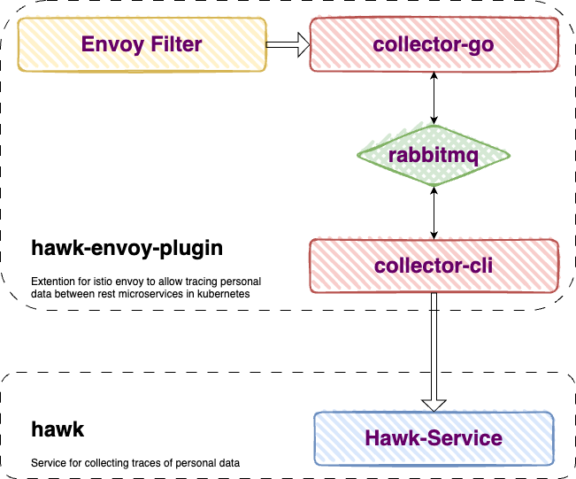

# hawk-envoy-proxy

[![Apache 2.0 License][license-badge]][license-link]

[license-badge]: https://img.shields.io/github/license/proxy-wasm/proxy-wasm-rust-sdk
[license-link]: https://github.com/PrivacyEngineering/hawk-envoy-plugin/blob/master/LICENSE

Extension for istio envoy to allow trace personal data between rest microservices in kubernetes



## Helm Chart

This helm chart is used to deploy the envoy filter in a target kubernetes-namespace.

## TL;DR

Create target namespace (e.g sock-shop), where your application will run.

```console
kubectl create namespace sock-shop
```

Install `hawk-envoy-plugin` in `hawk-ep` namespace

```console
helm install hawk-ep . --namespace hawk-ep --create-namespace
```


## Prerequisites

- Kubernetes 1.16+
- Helm 3.0+
- Istio 1.6+
- [Hawk](https://github.com/PrivacyEngineering/hawk)

## Parameters

### Hawk-envoy-plugin parameters

| Name                                | Description                                                        | Value                                            |
| ----------------------------------- | ------------------------------------------------------------------ | ------------------------------------------------ |
| `hawkEnvoyPlugin.namespace`         | The target namespace to collect tracing data from                  | `"sockshop"`                                     |
| `hawkEnvoyPlugin.hawkServiceApiUrl` | Hawk Service Api Url in url-schema                                 | `http://hawk-service.hawk.svc.cluster.local/api` |
| `hawkEnvoyPlugin.httpbin`           | Whether a httpbin-namespace should be created for testing purposes | `true`                                           |


## Testing hawk-envoy-plugin

To test the plugin, the helm-chart uses the httpbin-namespace, which is created by the helm chart.

**Note:** The httpbin-namespace is only created if the `hawkEnvoyPlugin.httpbin` parameter is set to `true`.
```console
helm test -n hawk-ep hawk-ep --logs
```
